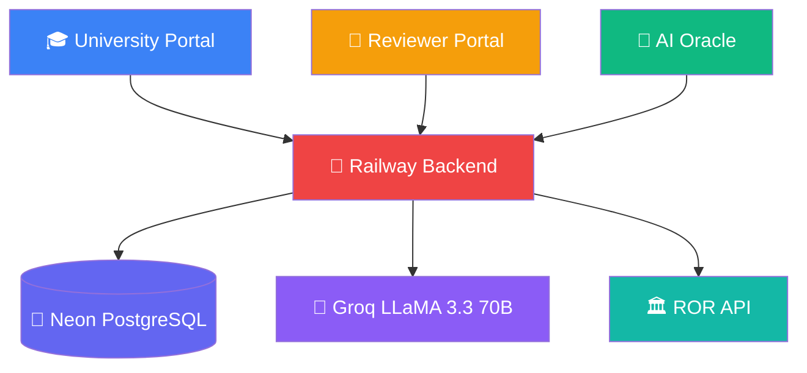

# 🚀 AksharaNexus

### *Where Ancient Knowledge Finds Its Source*

---

# 🛠 Technology Stack

| Category                        | Technologies                                |
| ------------------------------- | ------------------------------------------- |
| ☕ **Backend**                   | Java 17, Spring Boot, Maven                 |
| 🔐 **Security**                 | Spring Security, JWT Authentication, BCrypt |
| 🗄️ **Database**                | PostgreSQL (Neon)                           |
| 🔄 **ORM**                      | Hibernate, JPA                              |
| 🌳 **Version Engine**           | Custom Persistent N-ary Tree                |
| 🤖 **AI Oracle**                | Groq API, LLaMA 3.3 70B                     |
| 🏛️ **University Verification** | ROR API                                     |
| 🎨 **Frontend**                 | HTML5, CSS3, Vanilla JavaScript             |
| ☁️ **Hosting**                  | Railway, Netlify                            |
| 🔑 **Hashing**                  | SHA-256 Commit Hashes                       |
| 📦 **Serialization**            | Jackson                                     |
| 🔧 **Build Tool**               | Maven                                       |

---

# 🌟 Core Features

### 📚 Civilization Memory Tree

* Persistent immutable N-ary tree storage
* Git-style version control
* Full rollback support
* Historical provenance tracking

### 🏛️ Academic Review Pipeline

* University-authenticated contributors
* Multi-stage review workflow
* Central Registry publication system
* Divergence conflict management

### 🤖 AI Oracle

* Natural language querying
* Intent extraction engine
* Context-aware block ranking
* Citation-backed responses

### 🔐 Enterprise Security

* Triple JWT authentication chains
* Role-based access control
* BCrypt password protection
* Segregated portal architecture

---

# 🏗 System Architecture

---

# 📊 Platform Overview

| Portal                   | Purpose                                  | Users            |
| ------------------------ | ---------------------------------------- | ---------------- |
| 🎓 **University Portal** | Civilization authoring & version control | Admins & Editors |
| 🧐 **Reviewer Portal**   | Peer review & publication                | Reviewers        |
| 🤖 **AI Oracle**         | Public historical knowledge access       | Everyone         |

---

# 🧠 What Makes AksharaNexus Different?

✅ University-verified historical content

✅ Immutable Git-style civilization history

✅ Reviewer-controlled publication pipeline

✅ Explicit academic disagreement preservation

✅ AI answers generated exclusively from verified records

✅ Full provenance tracking for every published claim

> *Not a wiki. Not crowdsourced. A scholarly memory engine for civilization knowledge.*
